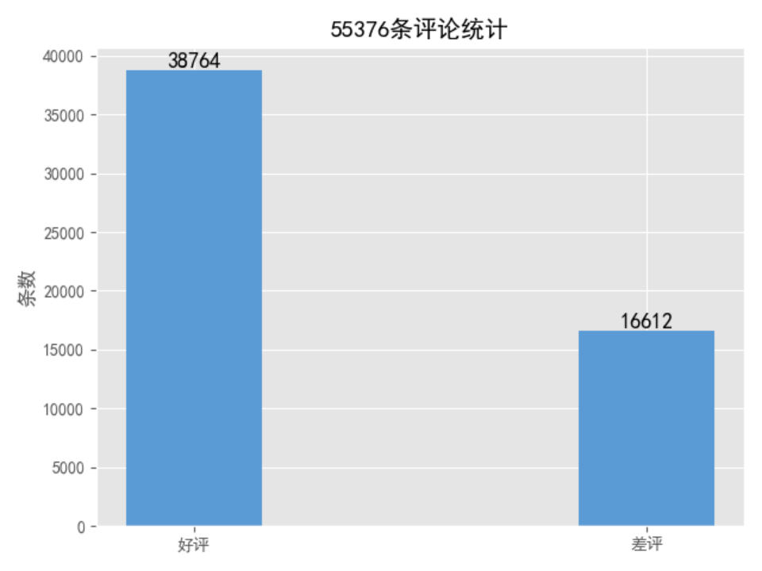
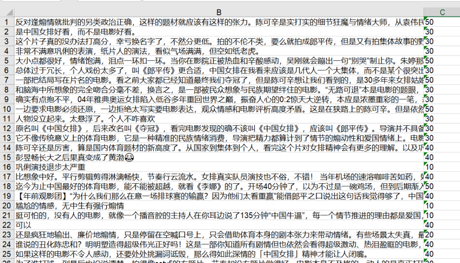
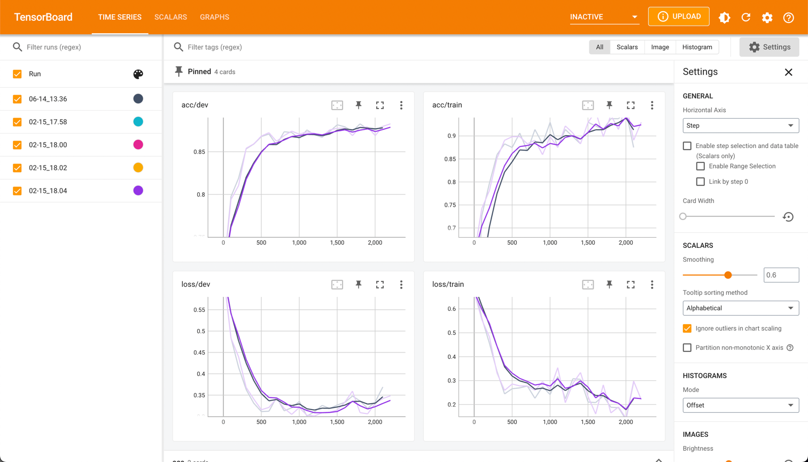
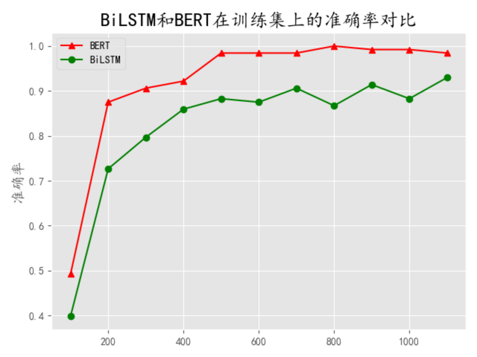
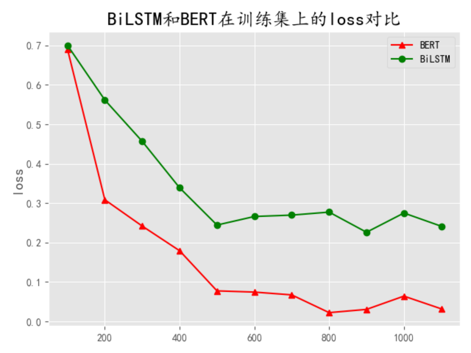
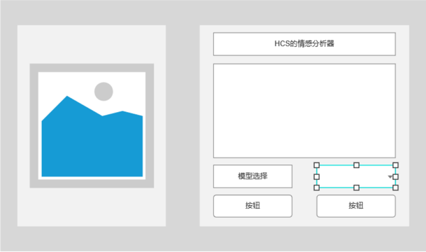
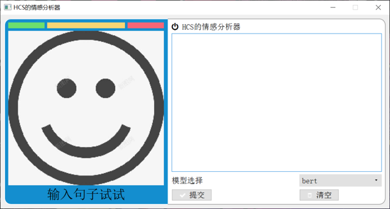
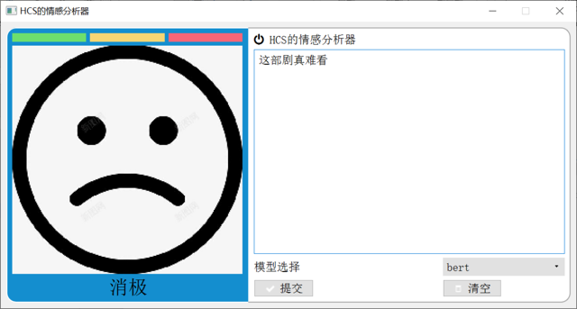
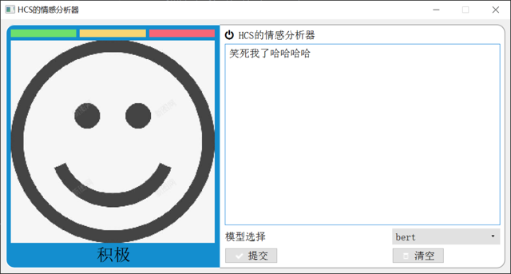

# 基于神经网络的文本分类


[](https://github.com/Lan-ce-lot)


## 🌐 介绍
一个简单的科研训练项目，基于神经网络的文本分类，为啥不做`CV`，还不是因为对`NLP`感兴趣~~(bushi)~~

## 📥 安装
`git clone https://github.com/Lan-ce-lot/pythorch-text-classification.git`
## 🛠 使用
```shell
# conda (recommended) to create a new conda env
conda env create -f environment.yaml
# or
conda install --yes --file requirements.txt
# pip
pip install -r requirements.txt
```

```shell
python run.py --model bert
```


## 🌏 环境
> * python 3.8
> * pytorch 1.3.1

## 💾 数据集

>爬取自[豆瓣短评](https://movie.douban.com/)
>豆瓣改版后加了很反爬机制，爬多了会封ip封号，解决办法：
> * 代理ip(免费不能用，要钱买不起)
> * 随机时间(>=5s)+随机User-Agent






## 🚙 模型
* BERT(Bidirectional Encoder Representations from Transformers) ✅
* ERNIE(Enhanced Representation through kNowledge IntEgration) ✅
* RNN(Recurrent Neural Network) 🤡
* CNN(Convolutional Neural Network) 🤡

## 📊 结果
集成了`tensorboard`，可以直接在终端查看训练过程
```shell
tensorboard --logdir=./data/log/textRNN
```



BiLSTM和BERT在训练集上的准确率对比

BiLSTM和BERT在训练集上的loss对比

---
| *模型*   | *训练集损失率* | *训练集准确率* | *测试集损失率* | *测试集准确率* |
|--------|----------|----------|----------|----------|
| BiLSTM | 0.29     | 0. 93    | 0.32     | 0.87     |
| BERT   | 0.03     | 0. 98    | 0.21     | 0.92     |


| *模型*   | *评论类别* | *准确率*  | *召回率*  | *f1-score* | *评论数量* |
|--------|--------|--------|--------|------------|--------|
| BiLSTM | 好评     | 0.8899 | 0.9238 | 0.9065     | 3779   |
|        | 差评     | 0.8216 | 0.7543 | 0.7865     | 1758   |
| BERT   | 好评     | 0.9332 | 0.9619 | 0.9474     | 3779   |
|        | 差评     | 0.9123 | 0.8521 | 0.8812     | 1758   |
## 📈 进度


## 📦 依赖

## 程序
采用python的pythonQt编写，
设计的两个按钮一个是提交，一个是清空，中间的文本框可用输入文字，左侧会显示情感分析结果，判断积极消极的情感。该程序布局如下图









## 📚 参考


## 📝 License
Apache © [Lan-ce-lot](https://github.com/Lan-ce-lot)
